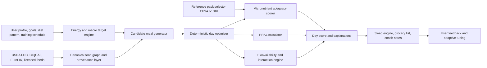
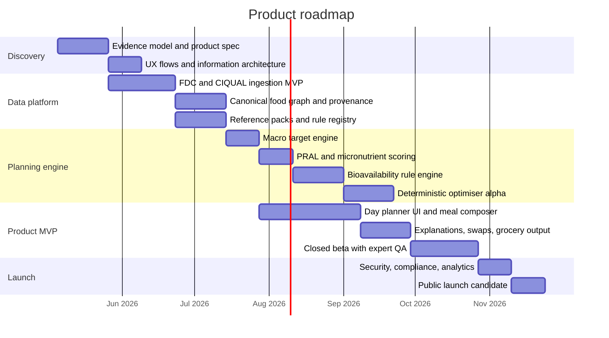

# Science-based single-day meal-planning app

## Executive summary

The strongest opportunity is **not** to build another calorie logger. The reviewed market leaders cluster into four patterns: mass-market trackers optimised for fast logging and adherence, coaching apps optimised for behaviour change or macro adjustment, automation tools optimised for meal generation, and health ecosystems where food logging is secondary to wearables. Across the twelve leading products reviewed, none combines **single-day optimisation**, **official nutrient-reference comparison**, **PRAL**, **meal-level bioavailability and interaction logic**, **athlete energy-availability guardrails**, and **explicit evidence/provenance transparency** in one coherent product. That is the white space. citeturn13view0turn13view3turn13view4turn13view6turn16view7turn16view9turn15search2turn13view8turn40search0

The product should therefore be positioned as an **explainable day optimiser**: a web app that takes a user’s body data, weight goal, dietary pattern, training schedule, time/budget constraints, and food preferences, then generates a one-day plan that hits kcal and macros while also scoring micronutrients against official reference values, estimating PRAL from current nutrient records, showing likely absorption constraints, and explaining *why* a recommendation is made. The core data layer should be built on current authoritative food-composition sources such as entity["organization","U.S. Department of Agriculture","US nutrition agency"] FoodData Central, the entity["organization","European Food Safety Authority","EU food safety body"] ecosystem, and France’s entity["organization","Anses","French food safety agency"] CIQUAL, with reference packs sourced from EFSA and US DRI material maintained by the entity["organization","National Institutes of Health","US biomedical agency"] Office of Dietary Supplements. citeturn37view3turn37view4turn37view5turn37view1turn38view0turn39view0turn39view2

The key scientific design principle is **confidence-banded nutrition**, not false precision. PRAL is useful as a contextual acid-load metric, but should not be presented as a diagnosis. Bioavailability and nutrient interactions are real and important, but in free-living diets they are probabilistic. The same applies to athlete energy availability: the 2023 entity["organization","International Olympic Committee","sports governing body"] RED-S consensus explicitly notes that field measurement of energy availability is difficult, so the product should use risk flags, confidence ranges, and human-readable caveats rather than pretending to know exact absorbable iron or exact RED-S status from a diary alone. citeturn12search0turn12search4turn12search13turn43search0turn43search5turn29search12

Commercially, the best launch wedge is a **science-first premium planner for health-conscious users and athletes**, with a consumer freemium tier, a premium optimisation tier, and a professional mode for sports dietitians, coaches, or clinics. That allows the product to differentiate on rigour without needing to outspend mass-market incumbents on content or coaching headcount. citeturn24search0turn13view5turn19search0turn23view0

## Competitive landscape

Because exact app-store rankings change constantly, the analysis below focuses on **globally prominent or strategically important products** that shape user expectations in nutrition tracking, coaching, meal planning, or health logging. The “accuracy posture” column is an expert judgement based on **disclosed data provenance, database curation, logging modality, and micronutrient depth**. Direct head-to-head laboratory validation exists for only a minority of consumer nutrition apps, and recent reviews of digital diet applications still describe heterogeneous methods and variable scientific transparency across the category. citeturn40search0turn40search1

| App | Core features | Strengths | Weaknesses | Business model | Data / API / accuracy / UX notes | Sources |
|---|---|---|---|---|---|---|
| **entity["company","MyFitnessPal","calorie tracker app"]** | Calorie and macro diary, barcode scan, Meal Scan, voice logging, fasting timer, recipe importer, wearable integrations | Huge reach, fast logging, strong ecosystem, familiar default for mainstream users | Public-facing materials emphasise scale and convenience more than nutrient provenance or deep micronutrient science | Freemium with Premium and Premium+ | 20M+ foods; approved-partner API rather than open developer access; diary-first “quick-add” UX; strong kcal/macro convenience, lower scientific confidence for deep micronutrient work than curated-database specialists | Official product and developer materials. citeturn13view0turn13view1turn23view0 |
| **entity["company","Cronometer","nutrition tracking app"]** | Full macro + micronutrient tracking, custom biometrics, recipes, Gold tier, professional dashboard | Explicitly curated and lab-analysed data; unusually strong micronutrient depth; suited to practitioners and quantified-self users | Less automated meal generation; more analytical than motivational | Freemium with Gold; practitioner-facing Pro offering | Public materials explicitly contrast curated/lab-analysed food data with crowdsourced approaches; strong detail-first UX; highest accuracy posture among consumer apps reviewed for nutrient completeness | Official site and product pages. citeturn13view2turn13view3turn24search0turn24search2turn24search4 |
| **entity["company","Lose It!","weight loss app"]** | Calorie tracking, barcode scan, photo logging, voice logging, fasting, weight goals, device sync | Strong onboarding, weight-loss focus, very large database | Limited scientific transparency on provenance and micronutrient depth in reviewed materials | Freemium with Premium | 56M+ food items; device integrations; no public nutrition API surfaced in reviewed material; budget-first, progress-first UX; good kcal adherence tool, moderate science depth | Official pages and app description. citeturn20search0turn20search1turn20search3 |
| **entity["company","Lifesum","nutrition app"]** | Calorie/macro tracking, meal plans, recipe library, fasting, personalised feedback, health-platform sync | Polished lifestyle UX, broad habit support, good visual design | Public data-source transparency limited; less athlete-grade nutrition logic | Freemium subscription model | Syncs with Apple Health and Health Connect; polished card-based UX; likely strongest for habit coaching and meal-plan aesthetics rather than evidence explainability | Official site and help content. citeturn16view2turn16view3turn15search11 |
| **entity["company","YAZIO","nutrition app"]** | Calorie tracker, AI photo logging, fasting, recipe plans, macro tracking, wearables sync | Large global footprint, strong fasting/weight-loss flows, smooth mobile UX | Its own help material says AI photo estimates are approximate; provenance transparency is limited in reviewed materials | Freemium with Pro | AI photo, barcode, manual logging, Apple Health and Health Connect sync; consumer-friendly wizard UX; convenient but less auditable than curated-data products | Official site and help materials. citeturn16view0turn16view1turn22search11 |
| **entity["company","MyNetDiary","nutrition app"]** | Verified food database, deep micronutrients, AI meal scan, disease-oriented planning, export tools | Verified-food posture, up to 108 nutrients, B2B/API angle, ad-free positioning | Less distinctive athlete periodisation and less coaching drama/community than Noom-like products | Freemium with premium tiers and API/database licensing | Publicly claims verified database and 108 nutrients; licensable food database/API is a notable differentiator; high accuracy posture for nutrient tracking | Official site, API page, and product materials. citeturn13view4turn13view5turn9search17 |
| **entity["company","MacroFactor","macro coaching app"]** | Coached/collaborative/manual macro programs, different macros by day, fasting-day support, micronutrients, nutrition import, export | Strongest adaptive macro coaching reviewed; body-composition focus; serious-user credibility | Meal planning and grocery automation are limited; underlying food-source provenance is less explicit than curated-database specialists | Premium subscription only | Imports nutrition from Apple Health and Health Connect; check-in-first UX; best-in-class macro adjustment logic, but less complete as a science-first meal-planner | Official site and feature pages. citeturn13view6turn22search0turn22search8turn18search1turn22search16 |
| **entity["company","Carbon Diet Coach","macro coaching app"]** | Personalised macro targets, weekly check-ins, custom foods/recipes, health-app sync | Strong coaching rhythm for physique/bodybuilding users | Limited public detail on nutrient provenance; less transparent micronutrient coverage than Cronometer/MyNetDiary | Subscription only | Syncs selected body metrics, but reviewed materials do not show public nutrition import or open API; coach-like UX with weekly adjustment loop | Official site and help centre. citeturn16view4turn16view5turn18search2turn22search22 |
| **entity["company","Noom","weight loss app"]** | Behaviour lessons, AI food logging, recipes, communities, coaching, body scan, wearable sync, GLP-1 companion | Strong engagement and behaviour-change scaffolding; could support adherence better than pure trackers | Lower transparency on nutrient calculation and interaction logic; simpler quality heuristics are less suited to athletes | Subscription; medication-related add-ons in adjacent offering | Lesson-first, psychology-first UX; useful for behaviour change, weaker fit for evidence-heavy day planning and micronutrient optimisation | Official site and app materials. citeturn10search4turn16view7turn19search0turn19search4turn19search5 |
| **entity["company","Eat This Much","meal planning app"]** | Automatic meal plans from calories/macros/preferences/budget/schedule, pantry, groceries | Best-in-class automation for generating meal plans and shopping lists | Public scientific transparency around nutrient provenance, bioavailability, and interactions is limited | Freemium with premium | Plan-first UX rather than diary-first; strategically the closest reference product for “single-day generation”, but not the strongest on nutritional science | Official site and feature page. citeturn16view9turn10search9 |
| **entity["company","Foodvisor","nutrition app"]** | Photo recognition, quantity estimation, recipes, plans, expert coaching | Very low-friction logging and modern onboarding | Image-based estimation creates error risk; official API/data-source transparency limited | Freemium with premium coaching | Photo-first UX; strong convenience, weaker auditability and micronutrient confidence than deterministic entry systems | Official site and help/product pages. citeturn15search2turn15search6turn17search1 |
| **entity["company","Fitbit","fitness app"]** | Food logging, barcode scan, calorie targets, macro breakdown, wearable metrics, Web API | Strong health ecosystem, biometrics context, developer API | Nutrition is secondary to wearables; barcode scanner is US-only on official support docs; micronutrient depth is less visible | Devices + Premium subscription | Dashboard-first health UX; broad developer API; valid ecosystem benchmark, but not a specialist meal-planning product | Official support and developer materials. citeturn13view8turn13view9turn11search10 |

A few market patterns matter more than the individual rows. **Cronometer** and **MyNetDiary** are the closest benchmarks for nutrient rigour. **MacroFactor** and **Carbon Diet Coach** are closest for adaptive body-composition logic. **Eat This Much** is the closest for plan automation. **Noom** sets the bar for adherence and behavioural scaffolding. **Fitbit** demonstrates the value of integrating food with passive health metrics. The opportunity is to combine the best of those categories without copying any one of them. citeturn13view3turn13view5turn13view6turn16view4turn16view9turn16view7turn13view8

The API picture is also revealing. In the reviewed material, **MyNetDiary** clearly offers licensable food-database/API capabilities, **MyFitnessPal** exposes a partner-controlled API, and **Fitbit** offers a broad developer API. Most other reviewed products surface **consumer integrations** instead of public nutrition APIs. That means an independent science-first planner has real platform space if it wants to become infrastructure, not just an app. citeturn13view5turn23view0turn13view9

## Gap analysis and differentiated product concept

**P0 — Provenance and confidence scoring.** The market badly under-explains where nutrient values come from. Your app should attach each food and day-level metric to a provenance tier: analytical database, branded label, calculated recipe, user-created entry, or image-estimated entry. The user value is trust: the app stops pretending that a photo estimate and a laboratory-analysed database line are equally reliable. citeturn37view3turn37view4turn38view0turn37view0turn13view3turn13view5turn15search2

**P0 — Meal-level bioavailability and interaction engine.** Nearly all reviewed apps track *gross* intake, not *likely usable intake*. A distinctive feature would be to interpret meals: plant-iron meals with vitamin C would score differently from plant-iron meals with tea, coffee, or high-phytate foods; zinc would be moderated by phytate context; calcium-rich, oxalate-heavy sources would not be treated the same as dairy or fortified foods. The user value is better planning quality without needing clinical jargon. citeturn39view1turn39view3turn39view4turn39view5turn26search11turn26search3turn28search2

**P0 — Athlete energy-availability and RED-S guardrails.** Most consumer planners can help users lose weight, but they do not adequately protect athletes from chronic under-fuelling. A differentiated product should flag when the requested weight-loss rate, planned intake, and training load together create a likely RED-S/LEA risk, especially in endurance athletes and female athletes. The user value is performance protection and lower injury risk. citeturn43search0turn43search5turn29search12turn42search20

**P0 — Deterministic single-day optimisation with trade-off explanations.** **Eat This Much** proves users want automatic meal generation, but the category still under-serves users who need the generator to optimise across *multiple scientific objectives at once*: kcal, macros, micronutrients, PRAL, food preferences, budget, prep time, and workout timing. The user value is that the app becomes a planner, not a poster of yesterday’s mistakes. citeturn16view9turn10search9turn40search0

**P1 — Locale-aware nutrient references and food datasets.** Micronutrient adequacy should not be hard-coded to one standard. Users should be able to select EFSA/UK-style or US DRI-based reference packs, and food search should prefer local composition sources where relevant. The user value is better cross-border relevance and fewer misleading adequacy scores. citeturn39view0turn39view2turn37view1turn38view0

**P1 — Science-aware secondary health metrics.** Beyond kcal/macros and RDA completion, the app should track a secondary layer of health markers such as PRAL, fibre density, sodium loading, potassium exposure, and supplement overlap. This is where the product can serve both general health users and serious athletes without becoming a medical device by default. The user value is a richer definition of “good day” than calories alone. citeturn12search0turn12search4turn25search1

**P1 — Explicit separation of food, supplements, and biomarkers.** Many apps blur food and supplement intake or do not version their assumptions clearly. Your app should separate “food adequacy”, “supplement-adjusted adequacy”, and “lab-informed interpretation” into different layers. The user value is transparency and lower risk of overconfidence. citeturn39view2turn39view3turn39view4turn13view8

**P2 — Evidence changelog and professional review mode.** Nutrition science changes, databases update, and heuristic rules evolve. A patient-facing explanation card and a professional-facing audit trail would create a moat that lifestyle-only products do not have. The user value is long-term trust and B2B extensibility. citeturn37view3turn37view5turn37view1turn13view5turn24search0

Taken together, the differentiated concept is clear: **Cronometer-grade data discipline + MacroFactor-grade adaptive goal logic + Eat This Much-style day generation + an evidence engine that explains what the plan is doing and where the uncertainty lives**. That combination is not currently visible in the reviewed market. citeturn13view3turn13view6turn16view9

## Scientific evidence and guidelines

The literature is most useful when translated into product rules rather than copied into the UI. The table below isolates the highest-value findings for this product.

| Topic | What the evidence says | Product implication | Sources |
|---|---|---|---|
| PRAL and dietary acid load | The Remer–Manz PRAL model estimates renal acid load from protein, phosphorus, potassium, magnesium, and calcium. Subsequent work linked dietary acid load with urinary acid excretion and urine pH. More recent commentary argues that original 1995 food-level PRAL values are not a safe modern lookup layer because food composition has changed. | Compute PRAL from *current nutrient composition data* at food and meal level; present it as a contextual metric and preference filter, not a disease diagnosis or primary optimisation target for everybody. | citeturn12search0turn12search4turn12search2turn12search13 |
| Official nutrient reference values | EFSA DRVs distinguish AR, PRI, AI, RI and UL, and explicitly note that DRVs are reference values for healthy populations rather than individual prescriptions. NIH ODS points to DRI tables and a DRI Calculator for dietary planning. | Let users choose a reference pack; compare intake against RDA/PRI/AI and UL separately; never confuse label %DV with personal adequacy. | citeturn39view0turn39view2 |
| Iron bioavailability | EFSA notes that iron absorption is inefficient and variable, depending on host and dietary factors. WHO/FAO guidance and ODS materials identify enhancers and inhibitors, and ODS advises taking calcium and iron supplements at different times. A 2024 meta-analysis suggests vitamin C co-supplementation with oral iron has only modest clinical benefit overall, so product claims should stay conservative. | Estimate *range-based absorbable iron* rather than a false single value; use meal rules for vitamin C, tea/coffee/polyphenols, phytate, and calcium supplement timing; avoid wording that implies treatment. | citeturn39view1turn39view3turn26search11turn27search0 |
| Zinc and competing factors | ODS notes that iron supplements containing 25 mg elemental iron or more can reduce zinc absorption when taken together, while fortified-food iron usually does not meaningfully interfere. Zinc bioavailability is also strongly shaped by phytate context. | Add supplement-timing warnings for iron–zinc combinations; where phytate data or heuristics are available, estimate meal-level zinc usability and confidence. | citeturn39view4turn26search3 |
| Calcium and food matrix effects | Recent reviews of calcium bioaccessibility in plant products show meaningful variation across sources, rather than “all plant calcium is equal”. | Tag calcium sources by expected usability class; avoid treating all plant sources as equivalent in “effective calcium” views. | citeturn28search2 |
| Athlete energy availability and RED-S | The 2023 IOC RED-S consensus emphasises prevention and treatment; later commentary highlights that energy availability is difficult to measure accurately in the field. A 2025 meta-analysis found LEA in roughly 45% of athletes studied and linked it with impaired performance and bone-related risks. | Build a guardrail layer that estimates *risk* from intake, training load, weight-loss rate, symptoms, and sex-specific context; do not pretend the app can diagnose RED-S from diet logs alone. | citeturn43search0turn43search5turn29search12 |
| Athlete protein and carbohydrate planning | The Academy/DC/ACSM position and later sports-nutrition reviews emphasise the type, amount, and timing of intake for health and performance. A 2022 meta-analysis showed higher protein intake produces small but real additional lean-mass/strength gains, and review work on dieting athletes supports roughly 1.6–2.4 g/kg/day during weight loss. Contemporary carbohydrate reviews continue to support training-load-aware fuelling rather than blunt restriction. | Set daily protein first, then distribute it across meals; scale carbohydrate to training load and session timing; let fat fill the remainder while staying inside general guardrails. Make the app adapt the whole day around the workout calendar. | citeturn42search25turn42search0turn42search14turn42search6 |
| Safety and body-composition practice | A 2025 systematic review found diet and fitness app use is associated with body image concerns and disordered-eating symptomology in cross-sectional evidence. Best-practice body-composition recommendations for athletes explicitly aim to reduce the burden of disordered eating, low energy availability, and RED-S. | Default to non-stigmatising language, optional hidden-calorie views, coach-reviewed modes for at-risk users, and clear escalation prompts instead of punitive streak mechanics. | citeturn33search0turn43search4 |

The most important scientific product choice is therefore **how uncertainty is communicated**. A scientifically serious nutrition app should often say “estimated low-confidence absorption”, “likely adequate”, or “potential interaction here” instead of implying lab-grade precision from self-reported meals. That is more faithful to the evidence and safer for users. citeturn39view1turn43search5turn33search0

## Data model and algorithms

The best data strategy is an **open-core canonical food graph** with source-specific enrichment. The open core should use USDA FoodData Central because it is public-domain, downloadable in JSON/CSV, has a REST API, exposes distinct data types, and is updated on different cadences for Foundation, FNDDS and Branded data. European coverage should be improved with CIQUAL for France and, where licensing or partnership permits, EuroFIR/FoodEXplorer and EUOpenFood-aligned datasets for harmonised European composition data. citeturn37view3turn37view4turn37view5turn38view0turn37view0turn37view1

A robust schema for an MVP-plus product would look like this:

| Entity | Key fields | Purpose |
|---|---|---|
| `food_source` | source_id, source_name, licence, refresh_frequency, provenance_tier | Tracks origin and legal status of each dataset |
| `canonical_food` | canonical_food_id, locale_name, food_group, processing_level, source_preference | Master food identity across sources |
| `food_variant` | source_food_id, canonical_food_id, brand, locale, raw_nutrients_json, completeness_score | Stores each source-specific representation |
| `portion_unit` | gram_weight, household_label, density_hint | Standardises serving conversion |
| `nutrient` | nutrient_id, unit, nutrient_type, upper_limit_supported | Canonical nutrient dictionary |
| `food_nutrient_value` | food_variant_id, nutrient_id, amount_per_100g, derivation_type, analytical_flag | Core nutrient store |
| `reference_pack` | pack_id, authority, geography, version, life_stage_map | EFSA/US DRI reference packs |
| `reference_value` | pack_id, nutrient_id, sex, age_band, pregnancy_status, value_type, amount | AR/PRI/RDA/AI/UL tables |
| `user_profile` | sex, age, height, weight, dietary_pattern, allergies, exclusions | Personalisation inputs |
| `goal_profile` | target_weight_change_rate, goal_type, kcal_target_mode, macro_strategy | Planning intent |
| `training_session` | date, sport_type, start_time, duration, intensity, fuelling_priority | Athlete-aware scheduling |
| `meal_template` | meal_type, prep_time, cuisine, ingredient_rules | Reusable meal candidates |
| `day_plan` | plan_id, date, user_id, objective_weights, confidence_score | Output object for one-day plan |
| `meal_item` | day_plan_id, meal_id, food_variant_id, portion_g, timing_context | Actual plan composition |
| `interaction_rule` | rule_id, trigger_conditions, effect_type, confidence_band, evidence_version | Meal-combining logic |
| `biomarker_entry` | ferritin, Hb, 25OHD, B12, test_date, clinician_override | Optional lab-informed interpretation |
| `audit_log` | changed_by, evidence_version, calculation_hash, timestamp | Reproducibility and scientific traceability |

**PRAL.** Use the validated Remer–Manz equation on **summed nutrient values**, not old static PRAL lookup tables:

\[
PRAL\,(mEq/day)=0.49 \times protein(g)+0.037 \times phosphorus(mg)-0.021 \times potassium(mg)-0.026 \times magnesium(mg)-0.013 \times calcium(mg)
\]

Compute it at the day level and optionally approximate meal contribution by recomputing using each meal’s nutrient totals. Because recent commentary questions direct reuse of 1995 food-level PRAL lookups in modern food environments, the stored value should always be **derived on the fly from current nutrient records**. citeturn12search0turn12search13

**Micronutrient comparison.** For each nutrient, calculate three layers: `food_only`, `food_plus_supplements`, and `food_plus_supplements_plus_clinician_overrides`. Compare those against the selected pack’s RDA/PRI or AI and against UL separately. The UI should report both **absolute intake** and **adequacy status**; if only AI exists, the explanation should say so explicitly instead of implying an RDA-grade confidence level. citeturn39view0turn39view2

**Bioavailability adjustment.** Do not promise exact absorbable values. Use a **rule-based range estimator** with evidence levels:

- For iron, split intake into haem-dominant and non-haem-dominant sources where possible; then apply meal-level modifiers for vitamin C, tea/coffee/polyphenols, phytate-rich companions, and calcium supplement co-use.
- For zinc, downgrade confidence and likely usability in high-phytate meals or when high-dose iron supplements are co-timed.
- For calcium, classify sources by expected usability rather than assuming equal absorption across all plant sources.
- For fat-soluble vitamins, flag meals that deliver most of the day’s A/D/E/K with very little fat as a possible absorption-risk scenario, but present it as a heuristic, not a medical fact. citeturn39view1turn39view3turn39view4turn26search11turn26search3turn28search2

A simple **meal-combining rule layer** can be implemented immediately:

| Rule | Trigger | App action | Evidence basis |
|---|---|---|---|
| Plant-iron + vitamin C synergy | Meal contains non-haem iron source + meaningful vitamin C source | Raise expected iron-usability band and explain why | citeturn39view1turn39view5turn26search11 |
| Tea/coffee penalty around iron-rich meals | Tea/coffee/cocoa added to or adjacent to plant-iron meal | Lower expected iron-usability band, suggest timing alternative | citeturn26search11turn39view1 |
| Calcium supplement versus iron supplement | High-calcium supplement co-timed with iron supplement | Show timing warning rather than changing food score silently | citeturn39view3 |
| High-dose iron supplement versus zinc supplement | ≥25 mg elemental iron supplement taken with zinc supplement | Show supplement interaction warning | citeturn39view4 |
| High-phytate meal | Large legume/bran/wholegrain/nut load without mitigation cues | Lower confidence for iron/zinc usability; suggest fermented/sprouted/alternative pairing where available | citeturn26search3turn26search11 |
| Calcium source quality | Calcium mainly from lower-bioaccessibility plant matrix | Separate “gross calcium” from “effective calcium estimate” | citeturn28search2 |

**Optimisation engine.** The planner itself should be deterministic and explainable. A practical approach is a mixed-integer optimisation or CP-SAT solver over discrete servings. The objective should minimise weighted penalties across: energy deviation, protein deviation, carbohydrate timing mismatch, fat floor violations, micronutrient deficiency penalties, UL penalties, PRAL preference penalty, budget, prep time, ingredient monotony, and user dislikes. ML can rank candidate meals or help with photo extraction, but **final scoring and nutrient maths should stay deterministic**.

The end-to-end data flow should look like this:

This architecture matters because it preserves a hard line between **data**, **rules**, and **recommendations**. That makes the product easier to validate scientifically and easier to regulate safely.

## Validation, privacy, regulation, and ethics

Scientific accuracy should be treated like versioned software, not like marketing copy. Food composition tables update, branded foods change monthly, and evidence for micronutrient interpretation evolves. FoodData Central alone exposes different update cycles across data types, while European initiatives explicitly frame maintenance and harmonisation as ongoing needs. The app therefore needs an evidence registry with semantic versions, effective dates, and audit logs for every calculation rule that can affect user guidance. citeturn37view3turn37view5turn37view1

A minimum validation stack is:

| Validation layer | Minimum bar |
|---|---|
| Deterministic maths tests | Golden tests for kcal, macro, micronutrient sums, PRAL, and %RDA/PRI/AI/UL calculations |
| Data-ingestion QA | Schema validation, unit validation, duplicate resolution, and provenance completeness checks on every source refresh |
| Cross-source reconciliation | Tolerance checks on canonical foods mapped across FDC, CIQUAL, and other sources |
| Expert review | Quarterly review of rules by a sports dietitian and a general clinical nutrition reviewer; ad hoc review for iron, RED-S, and supplement logic |
| Release governance | Calculation hash stored with every generated plan; visible changelog when evidence rules change user-facing outputs |
| Post-launch monitoring | Flag plans that repeatedly miss key nutrients or systematically under-fuel scheduled training days |

On privacy and governance, the app should assume that dietary logs, body weight, menstrual/life-stage data, biomarkers, and inferred risk scores constitute **health or special-category data**. Under UK GDPR/GDPR-style regimes, that means identifying both a general lawful basis and an Article 9 condition for processing. The UK ICO’s guidance is explicit that special-category data requires this extra step, and the European data-protection authorities treat health data as specially protected. citeturn32search2turn31search0turn31search16

For US operations, the product should avoid assuming HIPAA either does or does not apply. The current HHS mobile-health-app resources explicitly tell developers to assess which federal laws apply to their specific data flows, and the FTC’s Health Breach Notification Rule now clearly reaches many health-app and device contexts. If the app later integrates with providers, covered entities, or BAAs, the technical and contractual posture will need to change materially. citeturn32search0turn32search1turn32search9turn32search16

The regulatory line should be drawn deliberately. The best initial positioning is **general wellness and nutrition-planning support**. The current 2026 guidance from the entity["organization","U.S. Food and Drug Administration","US regulator"] preserves a lower-risk path for general wellness products, while the European Commission’s 2025 MDSW guidance and the UK MHRA software guidance both make clear that software can become regulated medical device software when it moves into clinical claims, diagnosis, treatment, or clinician-style decision support. If the product later makes disease-specific treatment claims or automated recommendations from laboratory biomarkers, the regulatory burden will increase sharply. citeturn31search5turn31search1turn31search6turn31search7

Ethically, nutrition apps increasingly need to be designed against **disordered-eating amplification**. The 2025 systematic review on diet and fitness monitoring apps found associations with body-image concerns, compulsive exercise, and disordered-eating symptomology in cross-sectional evidence. That means hidden-calorie mode, non-moralising copy, optional weight-neutral goals, conservative deficit defaults, and referral prompts for repeated under-fuelling or compulsive patterns should be considered part of the core product, not “nice to have”. citeturn33search0turn43search4turn43search0

## Architecture, roadmap, and delivery

For your stated stack, the cleanest path is a **typed web BFF plus dedicated optimisation/data workers**. Use Next.js/React/TypeScript/CSS Modules for the app shell and most product logic, but keep heavy food ingestion, normalisation, and solver jobs off the request path.

| Layer | Recommendation | Why | Sources |
|---|---|---|---|
| Front-end app | Next.js App Router + React + TypeScript + CSS Modules | Fits your stack, supports server/client composition, and allows clean separation between read-heavy pages and authenticated mutations | Next.js route handlers and server actions docs. citeturn34search0turn34search12turn34search19 |
| State management | Zustand, with `persist` only for non-sensitive drafts/preferences | Very small API surface, strong TS ergonomics, and easy client-state persistence where appropriate | Zustand docs. citeturn34search1turn34search13turn34search20 |
| App-facing API | Next.js Route Handlers for MVP CRUD and auth-adjacent endpoints; Server Actions for tightly coupled mutations | Current Next.js docs note route handlers are not cached by default unless explicitly configured, which suits mutable user data | citeturn34search0turn34search22 |
| Heavy backend services | Separate Node/Fastify worker service for ingestion, canonicalisation, and optimisation | Better operational isolation for long-running or compute-heavy jobs than stuffing everything into request-time functions | Recommended architecture inference based on stack and workload |
| Database | PostgreSQL as system of record, with normalised nutrient tables and JSONB for source metadata | Suits relational nutrient data plus flexible provenance fields; generated columns and JSON querying are useful for derived fields/search aids | PostgreSQL docs and release notes. citeturn36search0turn36search12turn36search4 |
| Managed platform option | Supabase for Postgres + Auth + Storage if you want faster MVP delivery | Convenient integration path with Postgres, Auth, Storage, replication, and GraphQL options | Supabase feature/docs pages. citeturn35search15turn36search9turn36search17turn36search21 |
| Caching | Redis for hot food-search results, day-plan caches, and short-lived solver outputs | TTL-aware caching is straightforward and well supported | Redis docs. citeturn36search2turn36search6turn36search14 |
| Edge/CDN | Cloudflare for static assets and image/media optimisation | Strong global caching and edge image handling; useful for recipe/media-heavy experiences | Cloudflare docs. citeturn36search3turn36search11turn36search19 |
| Deployment | Vercel for the web/BFF tier; separate worker runtime for ingestion and optimisation | Vercel Functions suit UI-adjacent server workloads and environment management cleanly | Vercel docs. citeturn35search3turn35search7turn35search11 |
| External integrations | Apple Health / Health Connect / Fitbit later, but keep them optional | Valuable for body-weight trends and training context, but not required for scientific nutrition MVP | Competitor benchmark and official Fitbit API docs. citeturn13view9turn13view8 |

The recommended delivery path is:

A realistic MVP estimate for a senior, focused team is **about 28–36 weeks** from discovery to a credible public release, assuming tight scope and at least part-time access to a nutrition-domain expert. A sensible staffing estimate is:

| Workstream | MVP effort estimate |
|---|---|
| Product design and UX | 8–12 person-weeks |
| Front-end | 16–20 person-weeks |
| Backend / BFF | 12–16 person-weeks |
| Data engineering / ingestion | 12–16 person-weeks |
| Optimisation / rule engine | 8–12 person-weeks |
| QA / automation | 8–12 person-weeks |
| Security / DevOps | 4–6 person-weeks |
| Nutrition science / expert review | 6–10 person-weeks |

The development sequence should be **data correctness first, optimisation second, UX polish third**. In this domain, a visually elegant product with dubious nutrient logic is strategically weaker than an initially plain product with strong trust signals.

## UX, QA, and go-to-market

The UX should feel less like a punishment diary and more like a **decision cockpit for one day**. That matters scientifically as well as commercially: evidence linking diet/fitness app use with body-image and disordered-eating concerns means the product should avoid guilt-driven streaks and moralised “good/bad food” framing. A better tone is: “Here is the trade-off; here is the confidence level; here are three ways to improve the day.” citeturn33search0turn43search4

The key screens should be:

- **Onboarding baseline** — body data, goal, dietary pattern, locale, reference pack, allergies, budget, prep skill, training schedule.
- **Day dashboard** — kcal, macro targets, training slots, top deficiencies/excesses, PRAL score, confidence badge.
- **Meal composer** — add/edit meals, swap ingredients, inspect effects on day score immediately.
- **Nutrient scorecard** — progress bars for selected nutrients against RDA/PRI/AI and UL, with food-only vs supplement-adjusted views.
- **Interaction explainer drawer** — “why this meal scores as it does”, with plain-English rules such as “tea near this meal may reduce non-haem iron use”.
- **Athlete timing view** — pre-, during-, and post-session fuelling suggestions across the day.
- **Swap explorer** — “keep calories constant, improve iron and lower PRAL”, or “keep protein constant, reduce prep time”.
- **Evidence/provenance inspector** — source database, derivation method, confidence level, rule version.
- **Privacy and control centre** — export/delete data, hide calories, disable weight-loss prompts, manage integrations.

For visualisation, favour **clarity over novelty**. The most useful charts are likely to be: a kcal target-versus-plan waterfall; macro bullet charts in grams; a micronutrient adequacy heatmap with UL overlays; a PRAL-by-meal waterfall; absorbable-versus-gross iron/zinc comparison bars with uncertainty whiskers; and a day timeline showing meals against workouts. A radar chart can look impressive, but for many nutrients it is usually less interpretable than a heatmap or banded matrix.

The QA and CI/CD strategy should be strict:

- **Static quality gates:** OXlint as the primary linter, with incremental coexistence with legacy ESLint rules only if migration is necessary. OXlint’s own docs explicitly recommend it as the primary linter for most projects. citeturn34search2turn34search6
- **Unit and integration tests:** Vitest for business logic and React Testing Library for component tests that resemble real user interaction rather than implementation details. citeturn34search3turn34search7turn35search0turn35search4
- **End-to-end tests:** Playwright with parallel execution and trace capture for planner flows, auth, and data sync. citeturn35search1turn35search13turn35search17
- **Pipeline:** PR linting, type-checking, unit tests, integration tests, data-fixture tests, then Playwright smoke tests on preview environments; nightly full scientific regression suite for nutrient maths and canonical-food mappings. GitHub Actions’ Node guidance and setup-node support package/dependency caching cleanly for this workflow. citeturn35search14turn35search6turn35search2

Monetisation should mirror the actual value hierarchy of the category:

| Offer | What it includes | Why it works |
|---|---|---|
| Free | Basic day planning, limited nutrients, limited saved plans, no biomarker layer | Establishes daily utility and search visibility |
| Premium consumer | Full micronutrients, PRAL, interaction engine, athlete mode, swaps, grocery list, exports | This is the true differentiated science product |
| Professional | Client dashboard, reviewed templates, white-labelled reports, audit trail | Creates higher-ARPU B2B revenue and validation moat |
| Platform/API | Food graph, score engine, or planning engine for partners | Turns the science layer into infrastructure, not just UX |

The most credible go-to-market sequence is **niche first, broad later**. Start with users who actively feel the gap: physique athletes, endurance athletes managing fuelling, health-conscious professionals who already use trackers but want deeper nutritional intelligence, and sports dietitians or coaches who currently patch together multiple tools. Once the science engine is trusted, expand into broader wellness and preventative-health use cases. The reviewed market already shows that subscriptions, practitioner tools, and partner/API models are accepted patterns. citeturn24search0turn13view5turn19search0turn23view0

## Open questions and limitations

Two limits matter. First, this review prioritised **official and primary sources**, so for some commercial apps the public-facing documentation does not fully disclose nutrient provenance or API strategy; where that disclosure was absent, the report treats that absence itself as a competitive signal rather than inventing certainty. Second, some sports-nutrition target ranges still rely on a mix of older consensus papers and newer reviews because very recent universally adopted athlete-nutrition position statements are not available for every subtopic. That does not block product design, but it does argue for a versioned evidence layer and regular expert review. citeturn40search0turn43search0turn42search25